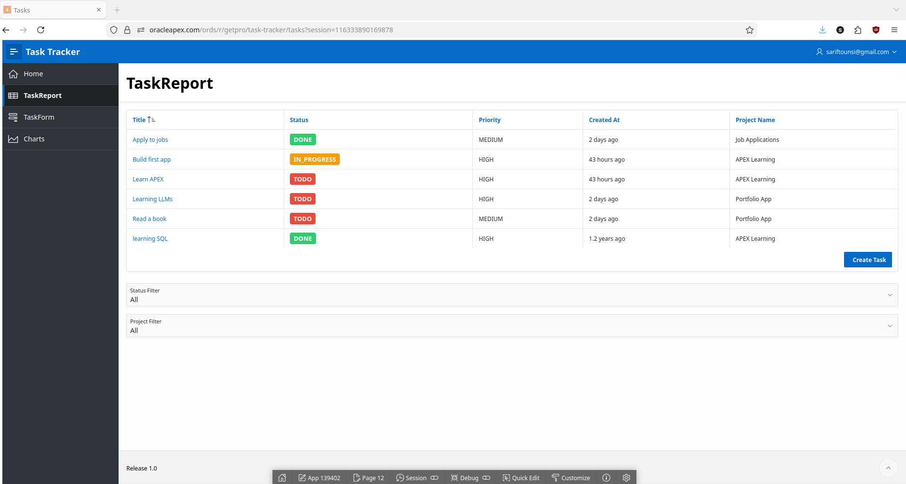
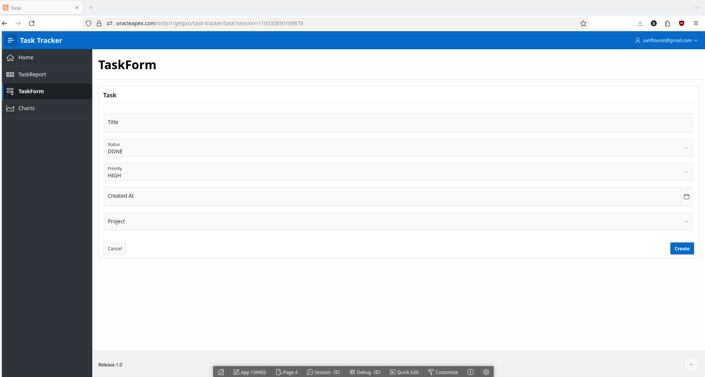
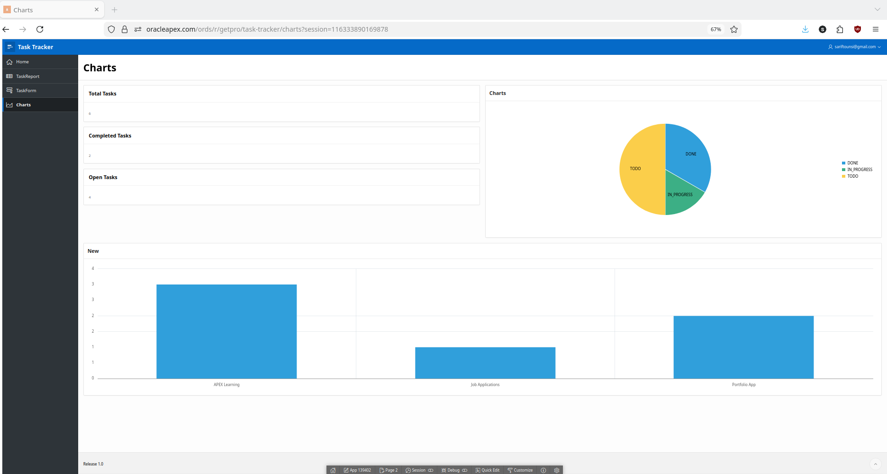

# Oracle APEX Project Task Tracker

A low-code task and project management application built with Oracle APEX.

## Features
- Projects and Tasks (relational model)
- Create and edit tasks
- Filter by status and project
- Dashboard with KPI cards and charts
- Click chart to filter tasks

## Tech Stack
- Oracle APEX
- Oracle SQL

## Screenshots

### Tasks

### Form

### Charts

